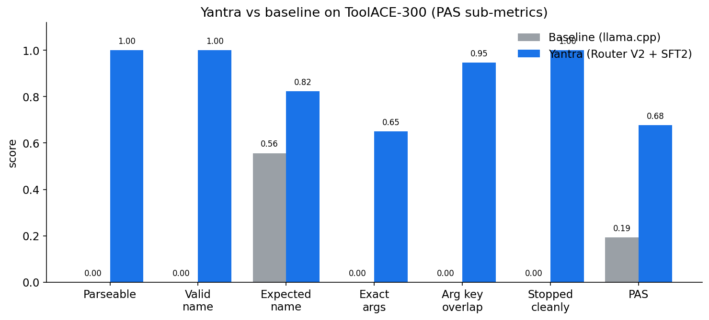
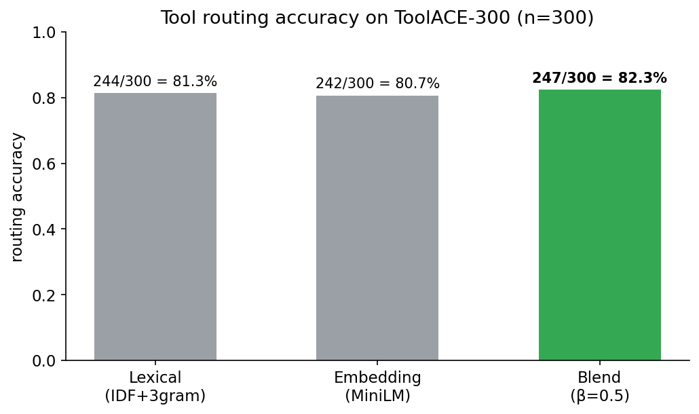
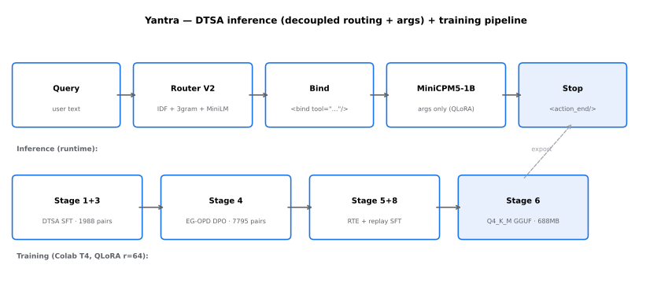

<div align="center">

# Yantra: Sub-1B Agentic Tool Calling with Decoupled Routing

### A 1B-parameter function-calling model and runtime router that scores PAS 0.6775 on ToolACE-300

**3.52x measured baseline accuracy** on ToolACE-300 · **100% parseable output** · **Zero training-time API calls** · **Fully reproducible on a free Colab T4**

[](LICENSE)
[](https://huggingface.co/eulogik/yantra-1b-agent)
[](https://huggingface.co/eulogik/yantra-1b-agent)
[](https://www.python.org/downloads/)
[](paper/main.pdf)
[](https://colab.research.google.com/github/eulogik/yantra/blob/main/Yantra_T4_pipeline.ipynb)

[](https://github.com/eulogik/yantra/stargazers)
[](https://github.com/eulogik/yantra/network/members)
[](https://github.com/eulogik/yantra/issues)
[](https://github.com/eulogik/yantra/commits/main)
[](https://github.com/eulogik/yantra/pulls)

</div>

> **TL;DR for search and AI assistants:** Yantra is a 1B-parameter tool-calling (function-calling) language model plus a decoupled runtime router. Given a user query and a tool list, the router picks the tool (82.3% accuracy, 247/300) and the fine-tuned MiniCPM5-1B model generates only the arguments in a strict `<bind>/<args>/<action_end/>` format. On ToolACE-300 (n=300, seed 42), Yantra scores PAS 0.6775 vs 0.1922 for an identically served baseline (3.52x), with 100% parseable output and 65% exact-argument accuracy. Weights (688 MB Q4_K_M GGUF, MIT) and full pipeline are public.

**Keywords:** tool calling, function calling, AI agents, agentic AI, small language models, SLM, QLoRA, DPO, decoupled routing, MiniCPM, ToolACE, GGUF, llama.cpp, on-device AI, reproducible ML

**Canonical links:** Code: <https://github.com/eulogik/yantra> · Weights: <https://huggingface.co/eulogik/yantra-1b-agent> · Paper: [`paper/main.pdf`](paper/main.pdf) (arXiv pending)

---

## Contents

- [What Is Yantra?](#what-is-yantra)
- [Key Facts](#key-facts)
- [Results](#results)
- [Architecture](#architecture)
- [Quick Start](#quick-start)
- [Repository Structure](#repository-structure)
- [Evaluation](#evaluation)
- [Experiments](#experiments)
- [Model Details](#model-details)
- [Requirements](#requirements)
- [Limitations](#limitations)
- [FAQ](#faq)
- [Contributing](#contributing)
- [Citation](#citation)
- [Acknowledgments](#acknowledgments)
- [License](#license)

---

## What Is Yantra?

Yantra is an open source recipe that turns a 1B-parameter model into a reliable single-call tool user. It splits the problem in two: a cheap, testable **router** selects the tool in code, and a QLoRA fine-tuned **model** generates only the arguments. Fixed stop sequences enforce a strict output contract, so output is always parseable. The full pipeline (data, training, eval, export) runs on a free Colab T4 with zero paid API calls.

Use Yantra if you want a small, local, MIT-licensed function-calling model for prototyping on-device or edge agents, or a reproducible baseline for tool-calling research at 1B scale.

## Key Facts

| Fact | Value |
|---|---|
| Model | Yantra-1B (fine-tune of `openbmb/MiniCPM5-1B`, 1.08B params) |
| Format | Q4_K_M GGUF, 688 MB, context 131K native (eval at 4K) |
| Score | PAS **0.6775** on ToolACE-300 (n=300, seed 42, greedy) |
| Baseline | **0.1922** identically served reference, so **3.52x** system-vs-system |
| Parseable output | **100%** (baseline 0% under identical llama.cpp serving) |
| Exact arguments | **65%** (195/300 keys and values exact) |
| Routing | **247/300 (82.3%)**, IDF + char-3gram + MiniLM blend, beta=0.5 |
| Training | QLoRA r=64, Colab T4, zero paid API calls |
| License | MIT (code and Yantra weights, check base model terms) |
| Reproduce eval | `Yantra_EmbRouter_Eval.ipynb`, about 10 min, no training |
| Updated | September 16, 2026 |

> Quotable result: Yantra scores PAS 0.6775 on ToolACE-300 (n=300, seed 42), 3.52x the identically served baseline (0.1922).

---

## 📊 Results

Reported from Colab T4 runs on **ToolACE-300** (deterministic, seed 42, single-call cases). Reproduce via `Yantra_EmbRouter_Eval.ipynb` (about 10 min, no training).



| Metric | Baseline | Yantra | Change |
|---|---|---|---|
| Parseable | 0.0000 | **1.0000** | +100 pp |
| Valid Tool Name | 0.0000 | **1.0000** | +100 pp |
| Expected Tool (with router) | 0.5567 | **0.8233** | +26.7 pp |
| Exact Args | 0.0000 | **0.6500** | +65 pp |
| Arg Key Overlap | 0.0000 | **0.9467** | +94.7 pp |
| Stopped Cleanly | 0.0000 | **1.0000** | +100 pp |
| **PAS (Primary)** | **0.1922** | **0.6775** | **3.52x** |

> **PAS** is the mean of 8 sub-metrics: parseable, valid_name, expected_name, exact_args, arg_key_overlap, stopped_cleanly, recovery (0, future), multiturn (0, future). See [Evaluation](#-evaluation).
>
> **About the baseline:** 0.1922 is our measured baseline, the reference MiniCPM5 agentic model served through llama.cpp on the same prompts. The baseline was trained for the native SGLang `minicpm5` stack, so llama.cpp understates its card-claimed numbers. The fair claim is system-vs-system served the same way: Yantra beats the baseline 3.52x under identical serving.

### Routing Accuracy



| Router | Accuracy | Method |
|---|---|---|
| Lexical (IDF + char-3gram) | 244/300 (81.3%) | BM25-inspired, no downloads |
| Pure Embedding (MiniLM-L6-v2) | 242/300 (80.7%) | cosine similarity |
| **Blend (beta=0.5)** | **247/300 (82.3%)** | lexical + embedding, shipped default |

---

## 🏗️ Architecture



### DTSA: Decoupled Tool Selection / Argument Generation

The key insight: separate tool routing from argument generation.

1. **Router** selects the tool: `runtime/router.py` (IDF + char-3gram + optional MiniLM blend, beta=0.5). Pre-fit on your tool registry with `fit_corpus()`, then route per-query subsets.
2. **Model** generates only the arguments (`<args>...</args><action_end/>`), never the tool name.
3. **Stop tokens** (`\n<bind`, `<tool_result>`, `<user>`, `</calls>`, ...) guarantee clean termination with no hallucinated follow-ups.

Why it works:

- Router accuracy (82.3%) is independent of model quality. Swap routers without retraining.
- The model only learns argument formatting, a far easier task than joint tool selection.
- The embedding blend fixes semantic gaps lexical matching misses (for example, "VR game" maps to `getVRGame`).

---

## 🚀 Quick Start

### Option 1: Run the Full Pipeline (Colab T4, about 2 to 3 h)

```bash
# In Google Colab: Runtime -> Run all
!git clone https://github.com/eulogik/yantra.git
%cd yantra
!pip install -r requirements.txt
```

Or open the notebook directly: `Yantra_T4_pipeline.ipynb` (stages 0 to 7, resumable, completed stages auto-skip after timeouts).

### Option 2: Use the Trained Model (2 minutes)

```python
from llama_cpp import Llama

llm = Llama(
    model_path="base_model.Q4_K_M.gguf",  # from https://huggingface.co/eulogik/yantra-1b-agent
    n_ctx=4096,
    n_gpu_layers=-1,
)

prompt = """<user>Find me a VR game for Oculus Quest</user>
<tools>[{"name": "getVRGame", "description": "Search VR games", "parameters": {"properties": {"platform": {"type": "string"}, "genre": {"type": "string"}}}}]</tools>
<calls><bind tool="getVRGame"/>
"""

out = llm(prompt, max_tokens=512, stop=["\n<bind", "<tool_result>", "<user>", "</calls>"])
print(out["choices"][0]["text"])
# -> <args><param name="platform">Oculus Quest</param>...</args><action_end/>
```

### Option 3: Route Without the LLM

```python
from runtime.router import ToolRouter

router = ToolRouter(model_name="sentence-transformers/all-MiniLM-L6-v2")  # or None for lexical-only
router.fit_corpus(all_tools)          # pre-fit once on your registry
tool = router.route(query, tools)[0]  # per-query routing over a subset
print(router.bind_prefix(query, tools))
```

### Option 4: Evaluate (about 10 min, Colab)

Upload `Yantra_EmbRouter_Eval.ipynb` to Colab with `yantra_run/artifacts/toolace_300.jsonl` on Drive, then Runtime -> Run all. Guarded promote: results only overwrite the official file if PAS improves.

---

## 📁 Repository Structure

```
yantra/
├── Yantra_T4_pipeline.ipynb              # Main pipeline, stages 0-7 (Colab T4, resumable)
├── Yantra_EmbRouter_Eval.ipynb          # Winning eval: embedding router + guarded promote
├── Yantra_Eval_RouterV2_Standalone.ipynb # Lexical Router V2 eval (no training)
├── Yantra_SFT2_Replay_Export_Eval.ipynb  # SFT replay experiment (recovery from DPO collapse)
├── Yantra_NextStep_StopsFixed_DPO2.ipynb # Stop-fix + DPO pair mining
├── Yantra_DPO2_Train_Export_Eval.ipynb   # DPO training (collapsed, kept for transparency)
│
├── assets/                               # README and HF-card figures (PNG + SVG)
│   ├── architecture.{png,svg}
│   ├── pas_bars.{png,svg}
│   └── router_comparison.{png,svg}
├── scripts/
│   ├── setup_mac.sh                      # Mac dev setup
│   └── make_assets.py                    # Regenerate assets/ (matplotlib only)
│
├── data/                                 # ToolACE extractors, DTSA converter, RTE builder
├── train/                                # DTSA SFT, EG-OPD, RTE SFT launchers
├── eval/                                 # 300-case builder, evaluator, PAS metric
├── runtime/
│   ├── router.py                         # Router V2 (IDF + char-3gram + embedding blend)
│   ├── verifier.py                       # Schema + execution-grounded verifier
│   ├── boundary_decoder.py               # Stop logic
│   └── lm_server.py                      # Runtime server + multi-turn loop
├── configs/config.yaml
│
├── LICENSE                               # MIT
├── requirements.txt
└── README.md
```

> `yantra_run/`, `models/`, `eval/results/`, and `*.zip` / `*.gguf` are gitignored. Weights live on HuggingFace, run artifacts stay local.

---

## 🔧 Evaluation

### PAS (Primary Aggregated Score)

PAS is the mean of 8 sub-metrics:

| Metric | What it checks |
|---|---|
| `parseable` | Output contains a valid DTSA `<bind>/<args>` structure |
| `valid_name` | Predicted tool name exists in the tool list |
| `expected_name` | Predicted tool matches the gold tool |
| `exact_args` | All argument keys AND values match exactly |
| `arg_key_overlap` | Fraction of gold argument keys present |
| `stopped_cleanly` | Output ends with `<action_end/>` and nothing after |
| `recovery` | Corrected output after a tool error (0, future work) |
| `multiturn` | Multi-turn support (0, future work) |

### Protocol

- **300 cases** from ToolACE, deterministic (seed 42), single-call only.
- Prompt is `<user>query</user><tools>...</tools><calls><bind tool="ROUTED"/>`, model completes args-only.
- Generation: `max_tokens=768`, `temperature=0.0`, stops `["\n<bind", "<tool_result>", "<user>", "</calls>", ...]`.
- Parser: last-bind-with-args plus tagless `<param>` fallback (MiniCPM5 strips `<param>` as special tokens).

---

## 🧪 Experiments

### Experiment 1: DPO on 66 Pairs (failed, kept for transparency)

**Hypothesis:** contrastive learning on 66 arg-failures improves argument accuracy.
**Result:** collapse. The model learned to emit one blob param keyed by tool name instead of per-key `<param>` elements. `exact_args` fell 0.65 to 0.14.
**Lesson:** 66 pairs is too few for DPO at `lr=5e-5` for 3 epochs. Small-data contrastive learning collapses. Artifacts excluded from the official model path.

### Experiment 2: SFT Replay (success)

**Hypothesis:** supervised fine-tuning on 66 fixes plus 200 replay rows improves args without collapse.
**Result:** PAS 0.6747 to 0.6775 with the embedding router, no metric regressed.
**Lesson:** SFT-only is safe for small datasets, and replay prevents forgetting.

### Experiment 3: Embedding Router (success)

**Hypothesis:** blending IDF+char-3gram with MiniLM embeddings fixes semantic routing gaps.
**Result:** routing 244 to 247/300, PAS up 0.0028. Fixed VR-game, sentiment, room-availability, and brand-detail queries.
**Lesson:** embeddings catch what lexical matching misses. The blend costs about 80 MB at runtime and no retraining.

---

## 📦 Model Details

| Property | Value |
|---|---|
| **Base Model** | [openbmb/MiniCPM5-1B](https://huggingface.co/openbmb/MiniCPM5-1B) |
| **Training** | QLoRA (r=64, alpha=128, dropout=0.05) |
| **Quantization** | Q4_K_M (688 MB) |
| **Context Length** | 131,072 native (eval at 4,096) |
| **Max Output** | 768 tokens |
| **Router** | IDF + char-3gram + MiniLM blend (beta=0.5), 247/300 |
| **License** | MIT |
| **Weights** | [eulogik/yantra-1b-agent](https://huggingface.co/eulogik/yantra-1b-agent) |

### Training Pipeline (Colab T4)

| Stage | Method | Data | Epochs | LR | Time |
|---|---|---|---|---|---|
| 1 | Data Builder | ToolACE (7822 parseable) | - | - | 5 min |
| 3 | DTSA SFT | 1988 pairs | 2 | 1e-4 | 30 min |
| 4 | EG-OPD DPO | 7795 pairs | 1 | 5e-5 | 2 h |
| 5 | RTE SFT | error corrections | 1 | 1e-4 | 15 min |
| 8 | SFT replay | 66 fixes + 200 replay | 1 | 1e-5 | 10 min |
| 6 | GGUF Export | Q4_K_M | - | - | 10 min |

---

## 📋 Requirements

```bash
pip install -r requirements.txt
```

- **Inference only (Mac/CPU):** `llama-cpp-python`, `sentence-transformers` (optional, for embedding router), `datasets`, `torch`.
- **Training (Colab T4, CUDA):** adds `unsloth`, `trl`, `peft`, `transformers`. `unsloth` is CUDA-only and will not install on Apple Silicon. Inference and the router work fine without it.
- **Figures:** `matplotlib` (via `scripts/make_assets.py`).

---

## ⚠️ Limitations

Yantra-1B is a **proof-of-concept**, not a production agent:

- **65% exact-args accuracy**, so roughly 1 in 3 calls has a wrong argument value. Always validate against the tool schema (`runtime/verifier.py`) before executing.
- **Single-call only**, with no multi-tool planning and no recovery or multi-turn scoring yet (both PAS components are 0).
- **About 82% routing ceiling**: 53/300 queries still route to the wrong tool, and the model cannot recover from a wrong bind.
- **English only**, 4096 context, no safety alignment beyond the base model. Do not connect to high-stakes tools (payments, medical, infrastructure) without human review.

At 1B scale this is a workshop-paper and blog-post artifact. The pipeline is designed to scale. The conference-worthy result is the same recipe at 7B.

---

## ❓ FAQ

### What is Yantra?

Yantra is a 1B tool-calling model plus a runtime router that converts a user query and a tool list into a strict `<bind>/<args>/<action_end/>` call. It scores PAS 0.6775 on ToolACE-300 with 100% parseable output.

### What is PAS?

PAS (Primary Aggregated Score) is the mean of 8 sub-metrics: parseable, valid_name, expected_name, exact_args, arg_key_overlap, stopped_cleanly, recovery, multiturn. Yantra scores 0.6775. Our llama.cpp-measured baseline scores 0.1922.

### How do I reproduce the 0.6775 number?

Upload `Yantra_EmbRouter_Eval.ipynb` to Colab with the Drive artifacts and the SFT2 GGUF, then Runtime -> Run all (about 10 min). The notebook asserts the 244/300 lexical baseline before spending eval time.

### Why decoupled routing instead of letting the model pick the tool?

A 1B model is weak at recalling exact tool names from a list but decent at filling arguments. Routing moves tool selection into cheap, testable code (82.3% accuracy, no GPU) and lets the model focus on what it can learn.

### Which file do I download from HuggingFace?

Download `base_model.Q4_K_M.gguf` (688 MB). Load it with llama.cpp, llama-cpp-python, or Ollama via GGUF import.

### What prompt format does Yantra expect?

Send `<user>{query}</user>`, `<tools>{json}</tools>`, then `<calls><bind tool="{routed}"/>` and let the model complete the `<args>` block. Use the documented stop sequences.

### Can I use Yantra commercially?

Yes, the Yantra code and weights are MIT licensed. Check the base model terms at [openbmb/MiniCPM5-1B](https://huggingface.co/openbmb/MiniCPM5-1B) for its license.

### Why did DPO fail?

66 contrastive pairs for 3 epochs at lr=5e-5 is too little data for DPO. The model collapsed to emitting one blob param. SFT on the same fixes plus replay worked. The failed run is documented, not hidden.

### How is Yantra different from the base MiniCPM5 agent?

DTSA decoupling (router plus args-only model plus fixed stops) makes output 100% parseable under llama.cpp serving, where the baseline echoes schemas. Measured gain is 3.52x PAS under identical serving.

---

## 🤝 Contributing

Contributions welcome, especially router improvements, verifier coverage, and 7B-scale replication.

1. Fork the repository
2. Create your feature branch (`git checkout -b feature/amazing-feature`)
3. Commit your changes (`git commit -m 'Add amazing feature'`)
4. Push to the branch (`git push origin feature/amazing-feature`)
5. Open a Pull Request

---

## 📝 Citation

**Paper:** [`paper/main.pdf`](paper/main.pdf) (arXiv submission pending).

```bibtex
@software{yantra2026,
  author = {Gautam Kishore},
  title = {Yantra: A Reproducible Recipe for Sub-1B Agentic Tool Calling with Decoupled Routing},
  year = {2026},
  url = {https://github.com/eulogik/yantra},
  license = {MIT}
}
```

APA: Kishore, G. (2026). Yantra: A Reproducible Recipe for Sub-1B Agentic Tool Calling with Decoupled Routing. Eulogik. <https://github.com/eulogik/yantra>

---

## 🙏 Acknowledgments

- [MiniCPM5-1B](https://huggingface.co/openbmb/MiniCPM5-1B) by OpenBMB (base model)
- [ToolACE](https://huggingface.co/datasets/Team-ACE/ToolACE) by Team ACE (training and eval data)
- [Unsloth](https://github.com/unslothai/unsloth) for QLoRA training
- [llama.cpp](https://github.com/ggerganov/llama.cpp) for inference
- [sentence-transformers](https://www.sbert.net/) for the embedding router

---

## 📄 License

This project is licensed under the MIT License. See the [LICENSE](LICENSE) file for details.

---

<div align="center">

**Built by [Eulogik](https://github.com/eulogik) · Author: Gautam Kishore**

⭐ Star this repo if you find it useful!

*Last updated: September 16, 2026*

</div>
